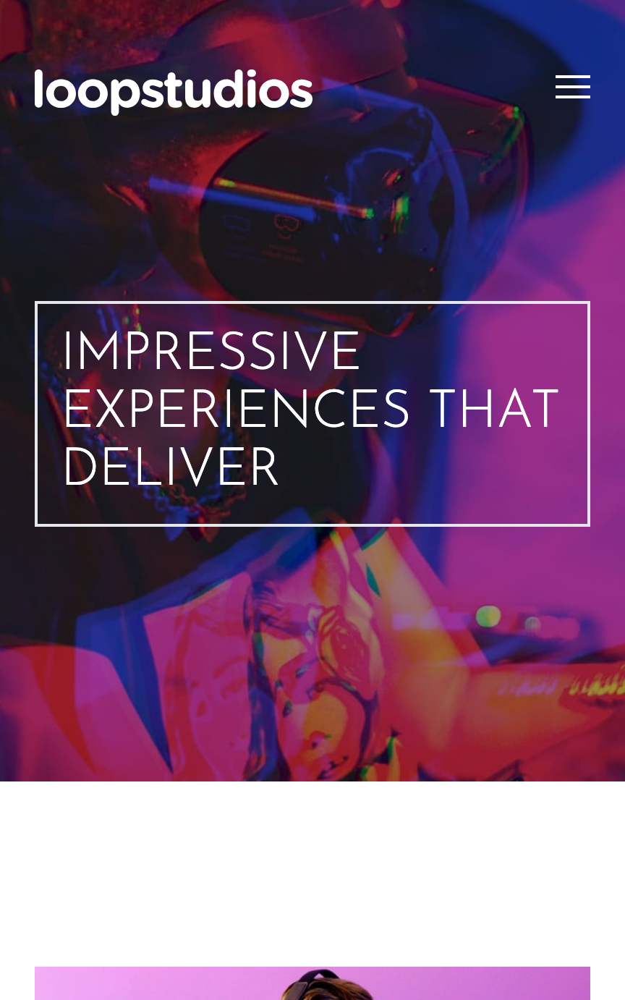

# Fylo Website

## Table of contents

- [Table of contents](#table-of-contents)
- [Overview](#overview)
  - [The challenge](#the-challenge)
  - [Screenshot](#screenshot)
  - [Links](#links)
- [My process](#my-process)
  - [Built with](#built-with)
- [Author](#author)

## Overview

### The challenge

Users should be able to:

- View the optimal layout for the site depending on their device's screen size
- See hover states for all interactive elements on the page
- Add JS mobile menu

### Screenshot

### Links

- Solution URL: [https://github.com/andrewteece/loopstudios-website](https://github.com/andrewteece/loopstudios-website)
- Live Site URL: [https://symphonious-blini-633160.netlify.app/](https://symphonious-blini-633160.netlify.app/)

### Built with

- Semantic HTML5 markup
- Tailwind CSS
- JavaScript

## Author

- Website - [https://andrewteece.com](https://andrewteece.com)

